# Dapper Hill Dog Boutique  

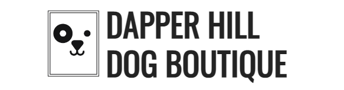

Dapper Hill Dob Boutique is an online presence for an award-winning dog salon in London, UK. 

This website targets pet owners interested in dog grooming and high-quality dog hygiene products. It provides new clients with business information, customer testimonials, and various services on offer.

I highly recommend this website to all!! I guarantee full satisfaction!! :)

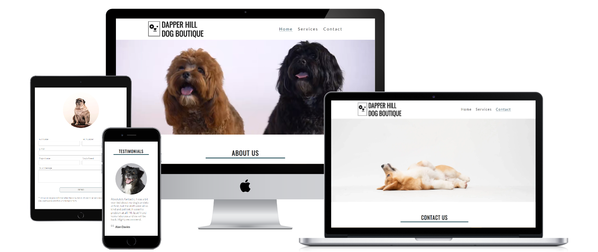

## Contents  

* [Features](#features)
  * [Navigation Bar](#navigation-bar)
  * [Landing Page](#landing-page)
    * [Hero Video](#hero-video)
    * [About Us](#about-us)
    * [Testimonials](#testimonials)
  * [Services Page](#services-page)
    * [Services Hero Image](#services-hero-image)
    * [Our Services](#our-services)
    * [Services Showcase](#services-showcase)
  * [Contact Page](#contact-page)
    * [Contact Hero Image](#contact-hero-image)
    * [Contact Us](#contact-us)
    * [Contact Form](#contact-form)
  * [Footer](#footer)
* [Responsive Design](#responsive-design)
* [Wireframes](#wireframes)
* [Design](#design)
  * [Colours](#colours)
  * [Typography](#typography)
* [Testing](#testing)
  * [Manual Testing](#manual-testing)
  * [Validation](#validation)
  * [Bugs](#bugs)
* [Deployment](#deployment)
  * [Development process](#development-process)
* [Credits](#credits)
* [Acknowledgments](#acknowledgments)

## FEATURES  

### Navigation Bar  

- The navigation bar is the first element on all three pages. 

- It is fully responsive and includes the Dapper Hill Dog Boutique Logo on the left and a page menu on the right.

- The logo is wrapped in a link and can be used to navigate to the homepage. 
  
- The navigation bar is identical on each page to allow for easy navigation from page to page across all devices.

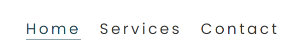
- All the items in the page menu link to their respective page. 

- When hovered, the links become underlined and adopt the main colour of the page.

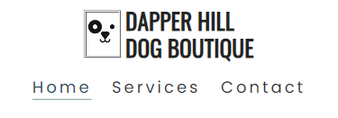
- On smaller screens, the menu is displayed below the logo. In order to reduce the necessary steps to navigate to a different page, the full menu is also shown on small devices instead of the usual hamburger menu. 

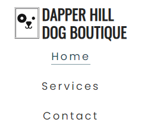
- To accommodate extra small screens (~280px), the menu changes to a vertical list when there is not enough space for the horizontal list.

### Landing Page  

#### Hero Video  

  
- The landing page features a full-width video displaying relaxed and happy dogs enjoying their visit to the Dapper Hill Dog Boutique.
- The short video allows a newly arriving user to linger for a moment and it immediately evokes a positive feeling. The goal is to create the impression that Dapper Hill Dog Boutique is a place where one would like to bring their dog.
- This section introduces the user to the services provided by the business, with an eye-catching animated video to capture their attention.

#### About Us   
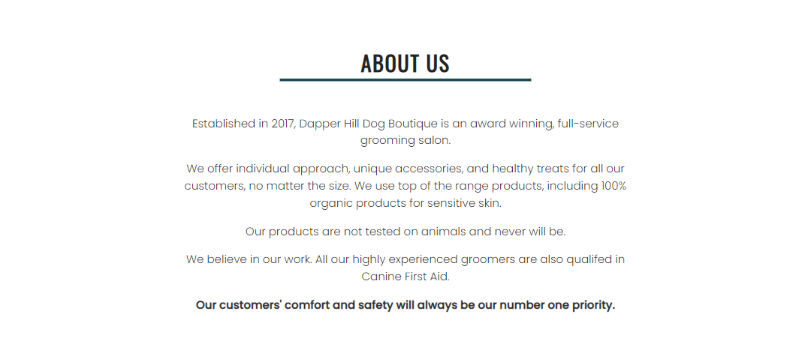
- The about us section introduces Dapper Hill Dog Boutique, its practices and qualifications.
- It includes the motto to present the user with the beliefs and ethical stance of the business.

#### Testimonials  
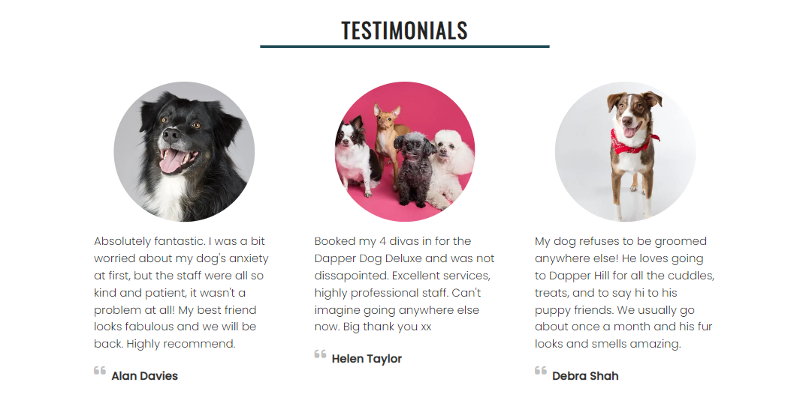
- The testimonials section displays three customer reviews combined with an image of their groomed dog. 
- The testimonials, written in the customers' own words, convey reliability and trustworthiness to the user.

### Services Page  

#### Services Hero Image
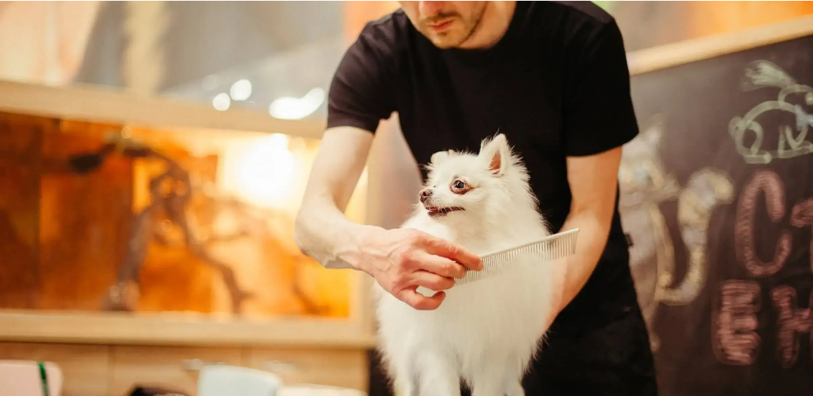
- The services page features a hero image in the same style as the hero video on the landing page. This creates consistency across all pages. 

#### Our Services  
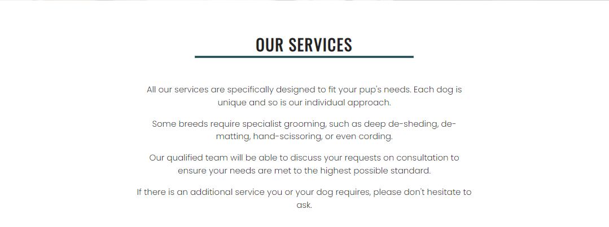
- In the services section, the user can read about the business's approach to dog grooming and its special services.
#### Services showcase  
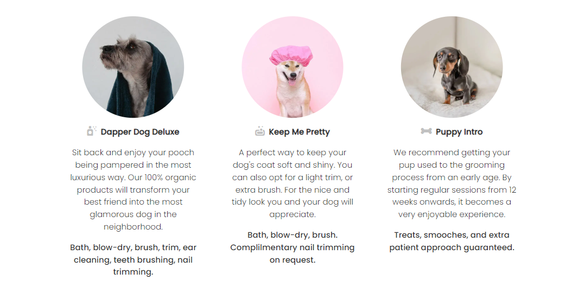
- This section displays the three main services offered by the Dapper Hill Dog Boutique. They are combined with descriptive images of dogs. 
- This section is structured in the exact same style as the testimonials section on the homepage to provide consistency. 

### Contact Page   

#### Contact Hero Image
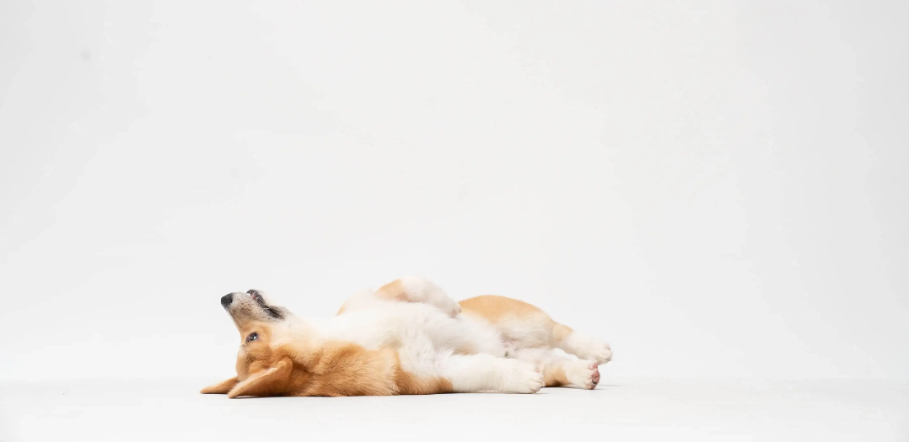
- The contact page features a hero image in the same style as the hero video on the landing page. This creates consistency across all pages.

#### Contact Us  
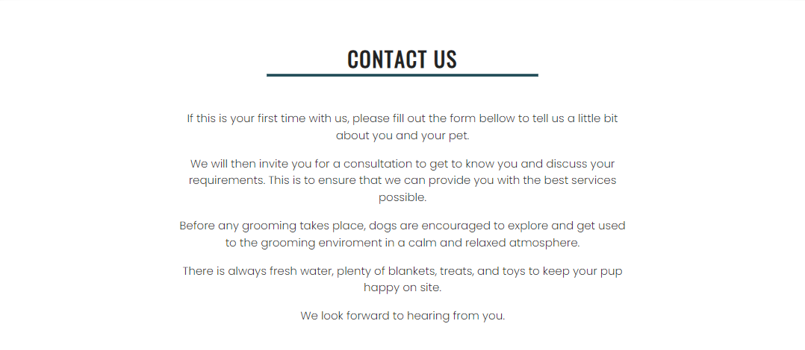
- This section invites the user to contact Dapper Hill Dog Boutique using the contact form provided below. It acts as a call to action and prompts the user to engage.

#### Contact Form  
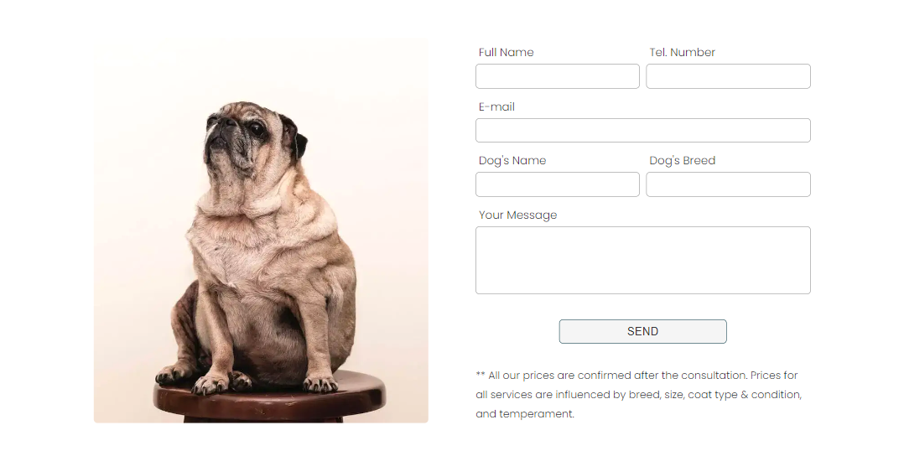
- The contact form features inputs for the users' full name, telephone number and email address. There are two inputs for the name and breed of their dog and a big textarea for their message. 

- The submit button is placed at the bottom of the form.

- All the inputs utilise the 'required' attribute to ensure that all the inputs are filled with valid data before submission.

- Since the form only requires easy information from the user, any hints or placeholders were omitted from the form. This achieves a clean and modern look. 

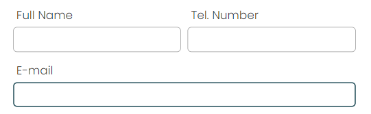
- For a better user experience, the active input has a border and the submit button changes colour when hovered.

### Footer  
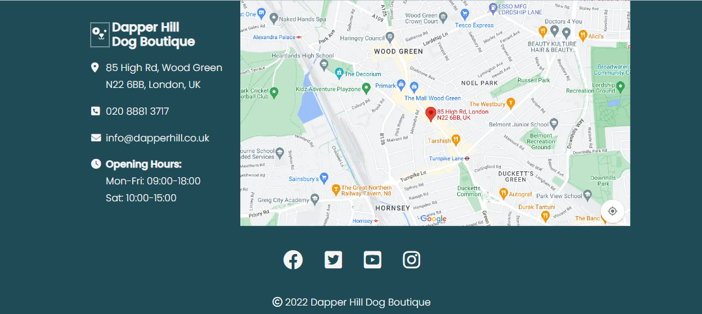
- The footer is the last element on all three pages and it is also fully responsive. 

- On the left is a smaller version of the Dapper Hill Dog Boutique Logo, together with all the business information. This way the business information is always present and easy to access.

- On the right, a map indicates the exact location of the business in London, UK.

- At the bottom of the footer, the user can find links to four different social media websites. Each link opens in a new tab.

- The last element of the footer is the copyright text.

## Responsive Design  
- The entire page, except the hero image and video, have a maximum width of 1140px to ensure a good user experience on bigger screens.
- The website uses media queries to optimise the available space on different screen sizes.
- The layout utilises Flexbox for responsiveness.

## Wireframes  

Wireframes were created for the mobile and desktop version of the website with the Program [Balsamiq](https://balsamiq.com/).

[Image of the wireframes](assets/docs/wireframes.png)

## Design  

### Colours  
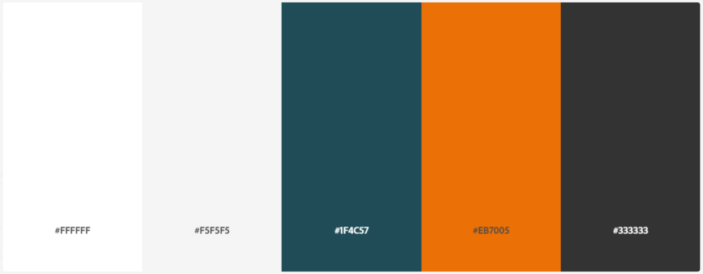
- The website uses a palette of three grayscale tones,  dark blue as the primary colour and orange as the accent colour.
- The greyscale colours are used as the main text and background colour.
- The primary colour is used for all the headings and interactable elements on the page. It is also used as the background colour for the footer to clearly separate it from the content.
- The accent colour is used for contrast and it pairs well with the rest of the palette.

### Typography  
- For the page logo and headings, the font Oswald was used.
- For the menu and body, the font Poppins was used.
- The page uses a font size of 20px for greater readability and accessability for older audience.

## Testing   

### Manual Testing  
- I have tested the desktop and mobile version of the website with Chrome, Firefox and Edge on a Windows Computer.
- I have tested the mobile version with Chrome and Firefox on an android device. 
- I have tested the mobile version with Safari on an ios device.
- I have shared the website with multiple users to confirm the website functionality on different devices and to get feedback on their experience.
- I have tested all the internal and external links on the website.
- I have checked that the contact form requires valid inputs.

### Validation  
#### HTML  
     
There were no errors found on any page using the W3C HTML Validator.
#### CSS  
  
There were no errors found in the stylesheet using the W3C CSS Validator.
#### Lighthouse  
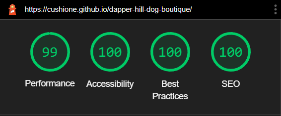   
I used the Chrome Lighthouse tool and received optimal scores for performance, accessibility, best practices and SEO.

### Bugs  
#### Fixed Bugs  
- Hero video didn't show the first frame as a placeholder until the video was completely loaded. Fixed by placing a poster attribute.
- The Hero video only played in fullscreen on ios devices. Fixed by adding a 'playsinline' attribute.
- After compressing the hero video with a modern compression method, the video stopped playing on multiple devices. Fixed by reverting back to a more widely supported compression method.
#### Unfixed bugs  
There are no unfixed bugs.

## Deployment  

The site was deployed using GitHub pages. 

The steps to activate Github pages are as follows:
- Navigate to the settings tab in the GitHub repository.
- In the settings, navigate to the 'Pages' tab on the left of the page.
- In the 'Build and deployment' section, select 'Deploy from a branch' in the source dropdown.
- Select branch 'main' and click on 'Save'.

The live link can be found here: [Dapper Hill Dog Boutique](https://cushione.github.io/dapper-hill-dog-boutique)

### Development process

- I started the program and repository by using the [gitpod template](https://github.com/Code-Institute-Org/gitpod-full-template) provided by the Code Insitute.  
- Then I regularly staged my changes using the command `git add <filename>` and then committed the staged changes to my local repository using `git commit -m 'short descriptive message here'`. 
- Finally, I would push the commits from my local repository up to the Github repository using the command `git push`.
- With every push, Github automatically deploys my latest commit from the 'main' branch to the Github pages.

## Credits  

- The video clips used in the hero video are from [mixkit.co](https://mixkit.co/) and were edited and cut with [Clipchamp](https://clipchamp.com/en/).
- The hero images on the services and contact page and the first image in the services section of the dog wrapped in a towel are from [Unsplash](https://unsplash.com/).
- All the images in the testimonials, the last two images in the services section and the image of the pug on the contact page are from [Pexels](https://www.pexels.com/).
- The image of the map is a screenshot taken from [Google Maps](https://www.google.com/maps).
- The icons in the footer, testimonials and services section were taken from [FontAwesome](https://fontawesome.com/).
- The fonts are imported from [Google Fonts](https://fonts.google.com/).
- The favicon was generated using [favicon.io](https://favicon.io/) with an emoji graphic of a poodle from the open-source project [Twemoji](https://twemoji.twitter.com/).

## Acknowledgments

I would like to acknowledge the following people who have helped me along the way in completing my first milestone project:
- My husband, Moritz Wach, for his unwavering support, patience, and feedback.
- My mentor, Spencer Barriball, for his quidance and advise. 
- My fellow students for their company and encouragement. 
